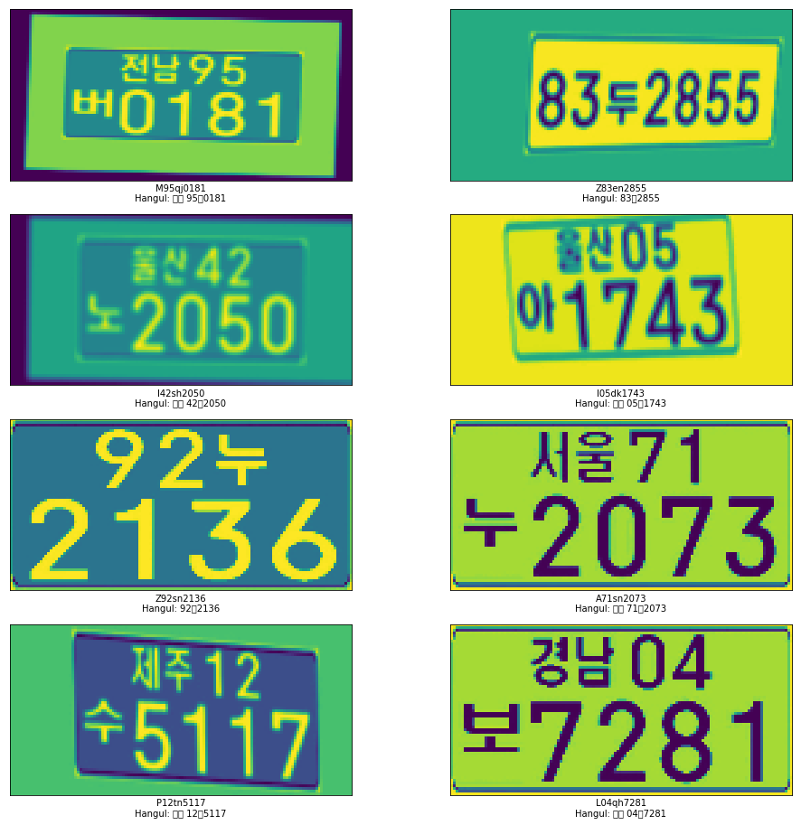

# Automatic-Number-Plate-Recognition

Automatic Car License/Number Plate recognition System developed as an ideation level project at DeepWrex Technologies.

## Korean(Hangul) Number Plates

**Article Link:** [https://soumik12345.github.io/geekyrakshit-blog/computervision/deeplearning/anpr/numberplate/neuralnetwork/crnn/convolution/recurrent/keras/python/tensorflow/2020/04/13/anpr.html](https://soumik12345.github.io/geekyrakshit-blog/computervision/deeplearning/anpr/numberplate/neuralnetwork/crnn/convolution/recurrent/keras/python/tensorflow/2020/04/13/anpr.html)

